## **"Explain, Don’t Just Warn!" - A Real-Time Framework for Generating Phishing Warnings with Contextual Cues**

[arXiv:2505.06836](https://arxiv.org/abs/2505.06836)

**Authors**: [Sayak Saha Roy](https://sayaksaharoy.com/), Cesar Torres, Shirin Nilizadeh


---

### **Phishing papers from top 4 2025**

**SP 25:**
* Understanding the Efficacy of Phishing Training in Practice
* Restricting the Link: Effects of Focused Attention and Time Delay on Phishing Warning Effectiveness
* **MANTIS: Detection of Zero-Day Malicious Domains Leveraging Low Reputed Hosting Infrastructure**

**USENIX Security '25 Cycle 1:**
* 'Hey mum, I dropped my phone down the toilet': Investigating Hi Mum and Dad SMS Scams in the United Kingdom
* Predictive Response Optimization: Using Reinforcement Learning to Fight Online Social Network Abuse
* **Evaluating the Effectiveness and Robustness of Visual Similarity-based Phishing Detection Models**

---

* When LLMs Go Online: The Emerging Threat of Web-Enabled LLMs
* DarkGram: A Large-Scale Analysis of Cybercriminal Activity Channels on Telegram
* **URL Inspection Tasks: Helping Users Detect Phishing Links in Emails**

**NDSS 25:**
* SCAMMAGNIFIER: Piercing the Veil of Fraudulent Shopping Website Campaigns
* The Kids Are All Right: Investigating the Susceptibility of Teens and Adults to YouTube Giveaway Scams


---

### **背景介绍（钓鱼网站）**

<div class="grid grid-cols-2 gap-4">
<div>

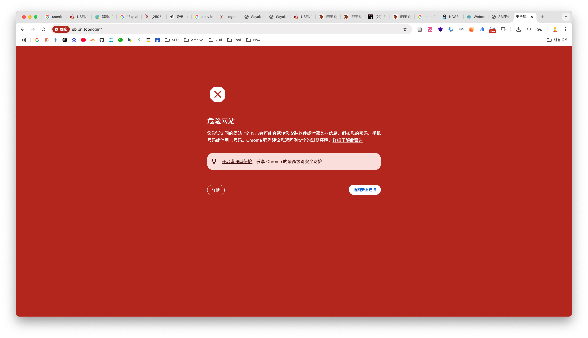

</div>
<div>

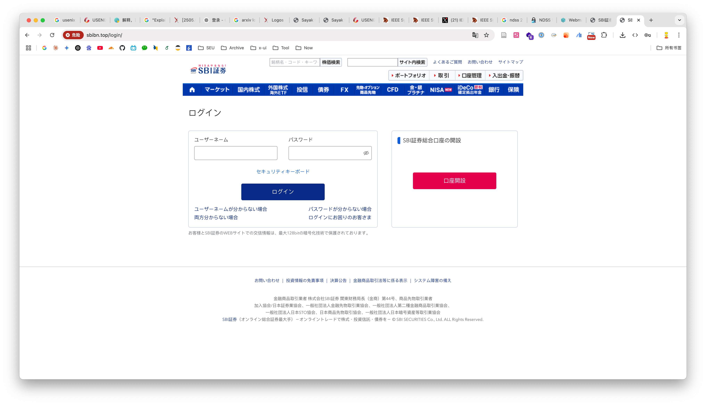
</div>
</div>

[**Phishing Supply Chain:**](https://interisle.net/insights/phishing-landscape-2024-an-annual-study-of-the-scope-and-distribution-of-phishing)

<div class="grid grid-cols-5 gap-1">
<div>

1. Obtain Attack Kit

获取钓鱼工具包等

</div>
<div>

2. Acquire Targets

获取目标（钓鱼目标或仿冒品牌）

</div>
<div>

3. Acquire Domain or Host Name

获取域名或主机名

</div>
<div>

4. Acquire Hosting Site

获取托管网站

</div>
<div>

5. Monetize Success

获利

</div>
</div>

---

### **研究现状**

1. **钓鱼攻击的威胁现状：时至今日，网络钓鱼依然是初始入侵的主力手段。** More than 90% of cyberattacks begin with phishing (CIA). 

    现有商业工具如Google Safe Browsing虽然在传统钓鱼威胁方面表现良好，但当工具失效时，用户往往处于脆弱状态，特别是缺乏技术背景的用户。同时，钓鱼攻击日益复杂化，利用先进工具包和AI技术创建规避性攻击，可以在被检测前保持活跃数小时甚至数天。

<div class="grid grid-cols-2 gap-4">
<div>

2. **现有反钓鱼工具的局限性**：当前基于浏览器的反钓鱼工具通常只发出标准化警告，不提供任何上下文信息解释为什么网站被标记为恶意。Google Safe Browsing的通用警告被95%的主要浏览器使用，但由于缺乏清晰度和可操作见解，用户经常忽略这些警告。商业工具主要依赖黑名单系统，而这些系统的提交信息不足以创建可解释警告，客户端检测方法又因使用轻量级模型而性能不足

</div>
<div>

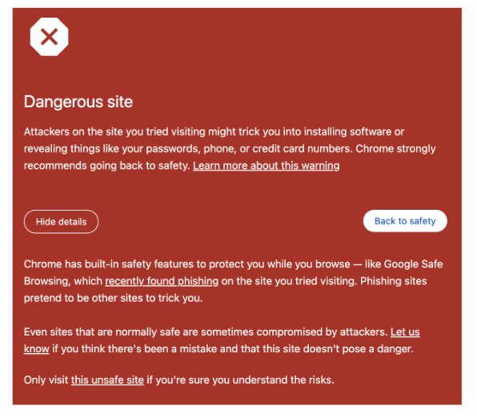

</div>
</div>

---

### **研究现状**

3. **深度学习和解释性方法的不足**：先进的深度学习方法虽然能利用网站截图进行检测，但存在黑盒性质、高计算需求和延迟问题，不适合实时部署。现有的解释性AI技术如LIME和SHAP虽然能提供一定的模型解释，但计算密集且产生的解释对普通用户过于技术化，主要设计用于事后分析而非实时用户指导。

<div class="grid grid-cols-2 gap-4">
<div>

LIME通过在待解释样本附近生成扰动数据，然后训练一个简单的可解释模型（如线性回归）来局部近似原始复杂模型的行为。其核心思想是：虽然全局模型可能很复杂，但在局部区域内可以用简单模型来近似。

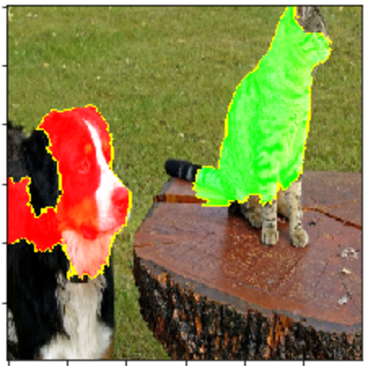

</div>
<div>

SHAP基于博弈论中的Shapley值概念，为每个特征分配一个重要性分数，这个分数表示该特征对预测结果的贡献度。

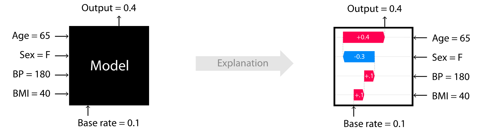

</div>
</div>

4. **用户行为和教育挑战**：研究表明用户经常忽略安全警告，认为它们过于侵扰或模糊，而大多数钓鱼警告很少解释网站危险的原因，这降低了用户学习动机并促进了对自动化工具的过度依赖(就像绝大多数人不会真的去阅读用户协议)。传统的企业安全培训通过视频、文档或年度研讨会进行，但往往过时、缺乏实践且频率不足，导致用户脱离和行为改变最小，缺乏行为科学基础且很少评估培训效果。

---

### **本文贡献**

本研究旨在开发一个名为PhishXplain的**实时可解释钓鱼警告系统**。


1. We implement the first real-time, on-device approach to generating contextual phishing warnings (PhishXplain) that ensures user privacy and replaces generic phishing warnings in order to provide users with more actionable information. 

    **设计实现了PhishXplain来取代传统的普通⚠️钓鱼警告形式**

2. Using prompt-engineer and custom lookup tables, we provide an optimized implementation that demonstrates a practical, lightweight LLM deployment that has minimal resource requirements and can even run on average consumergrade hardware.

    **使用提示工程和自定义查找表，开了一个可以在消费级端侧产品部署的轻量LLM**

3. We conducted a controlled user study with 150 participants, showing that our contextual warnings significantly enhance phishing detection and user confidence, particularly among users with low cybersecurity skills.

    **通过真实用户测评证明该工作的有效性**

---

### **框架设计**

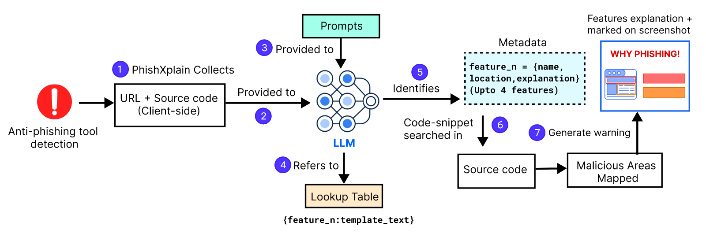

<div class="grid grid-cols-5 gap-4">
<div>

1. **URL和源码捕获**

负责获取完整的网页信息，为后续分析提供数据基础

</div>
<div>

2. **源码解析**

将HTML源码转换为结构化的、适合LLM分析的格式

</div>
<div>

3. **特征提取**

使用双重提示架构和预定义查找表，确保LLM输出标准化和准确性

</div>
<div>

4. **警告生成**

将识别出的特征转换为视觉化的用户友好警告界面

</div>
<div>

5. **客户端应用**

如何将整个框架打包为实际可以应用的浏览器拓展

</div>
</div>

---

### **PhishXplain告警形式**

PhishXplain生成的告警包含两个主要组成部分：
1. 被标记网站的屏幕截图
2. 针对网页可疑内容的描述列表，突出显示网页上识别出的最多四个恶意特征。每个识别 出的特征都包含一个专门针对所分析网站内容量身定制的解释，概述了每个恶意特征及其可疑之处。

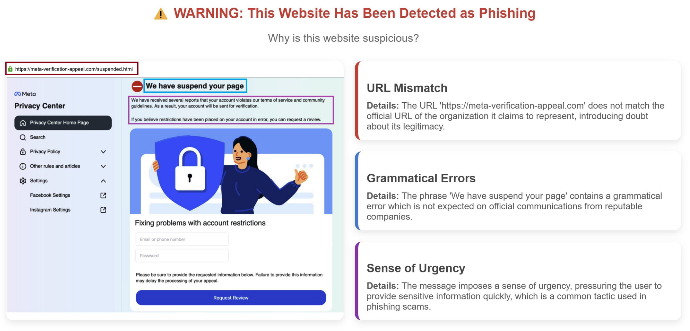

---

### **1. URL和源码捕获**

**核心功能**

负责获取完整的网页信息，为后续分析提供数据基础。

**技术实现**

- 动态内容捕获: 注入轻量级脚本访问浏览器内存中的DOM
- 完整渲染等待: 等待window.onload事件触发且网络空闲500毫秒
- 重定向处理: 记录所有重定向后的规范化URL
- 异步资源包含: 确保捕获所有动态加载的内容和第三方脚本（使用request请求跟使用无头浏览器请求请求的分别为静态爬虫和动态爬虫）

**关键价值**

确保分析的是用户实际看到的网页版本，而非静态源码，这对识别动态加载的钓鱼内容至关重要。

---

### **2. 源码解析**


**核心功能**：将HTML源码转换为结构化的、适合LLM分析的格式。

<div class="grid grid-cols-2 gap-4">
<div>

**处理策略**

- 标签提取: 重点提取10类用户可见元素：\<p\>, \<ol\>, \<h*\>, \<a\>, \<iframe\>, \<ul\>, \<form\>, \<button\>, \<li\>, \<input\>
- 唯一标识: 使用[ELEMENT X START]和[ELEMENT X END]格式为每个元素创建边界标识
- 嵌套处理: 对于嵌套标签，优先封装最外层实例以保持语义分组
- URL特殊处理: URL始终被指定为ELEMENT 0并置于源码开头
</div>
<div>

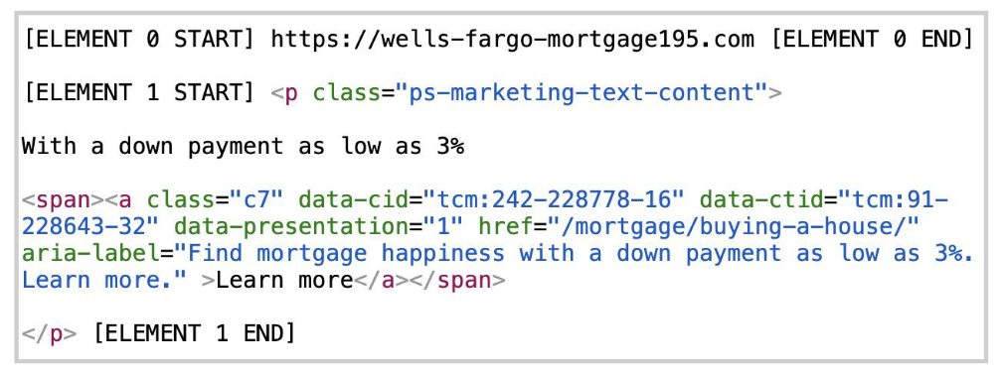


**Tip: 其实这一步骤的工作就是一类流行的MCP的功能，比如Firecrawl，它是一个基于LLM的MCP，可以解析HTML源码并提取出结构化的数据。**

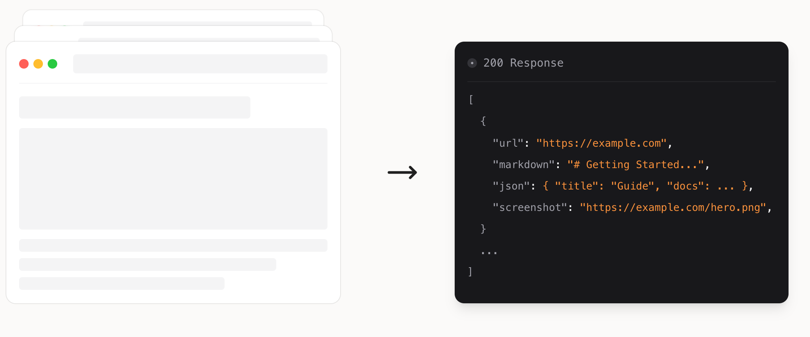


</div>
</div>

---

### **3. 特征提取**

**面临问题**：小型LLM往往容易产生不一致或虚构的特征识别结果，其面对同一个网站在多次执行中可能产生不同的特征识别结果

**核心功能**：为了解决上述问题，本文设计了一种双提示架构，该架构引用了预定义的网络钓鱼指标查找表，确保模型生成标准化的警告输出。


<div class="grid grid-cols-2 gap-4">
<div>

**查找表 (Lookup Table)是什么**

查找表由26种常见钓鱼特征构成，每个特征包含特征名称和模板文本。

每个特征采取填空机制，模板提供句子骨架，由LLM填入具体网站的相关信息

例如对于特征“"Spelling errors and typos"”
```
"The website has typos such as '[fill here]' and '[f
ill here]'. Typos in a website which is asking you 
for information often indicate a phishing attempt"
```

</div>
<div>

**查找表的构建过程**

- 样本选择: 从PhishTank随机选择1,000个钓鱼网站（2023年11月）
- 人工标注: 两名学术研究者（专注网络安全、钓鱼和LLM领域）进行编码

- 特征发现: 采用滚雪球方法，在评估过程中不断发现新特征
- 最终结果: 确定26种常见的用户可见钓鱼特征

</div>
</div>

---

### **3. 特征提取**

**26种钓鱼特征分类**

<div class="grid grid-cols-2 gap-4">
<div>

**视觉欺骗类**

- 品牌冒充: 使用知名公司logo和设计
- 页面布局: 模仿合法网站的视觉设计
- 图像滥用: 使用盗取的官方图像

**内容欺骗类**

- 拼写错误: 故意或无意的文本错误
- 语法错误: 不自然的语言表达
- 紧迫感: 创造时间压力的语言

</div>
<div>

**技术欺骗类**

- URL操控: 使用相似但错误的域名
- IDN同形攻击: 使用视觉相似的Unicode字符
- 第三方托管: 在非官方域名上托管钓鱼页面

**社会工程类**

- 敏感信息请求: 要求不当的个人信息
- 威胁恐吓: 使用法律或账户威胁
- 虚假奖励: 提供不现实的好处承诺

</div>
</div>

---

### **3. 特征提取（双重提示架构）**

**任务分解**：通过将复杂的"特征识别+解释生成"任务拆分为两个专门的子任务，避免让LLM同时处理多个不同类型的推理过程，每个提示专注于特定功能，提高准确性和一致性

<div class="grid grid-cols-2 gap-1">
<div>

**提示1: 特征映射 (Feature Mapping)**

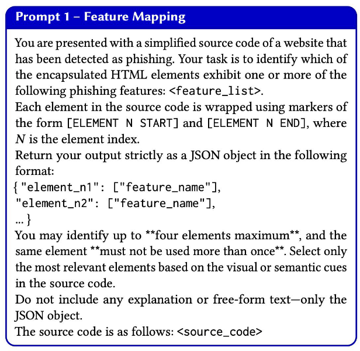


</div>
<div>

1. **元素扫描**：系统提供带有[ELEMENT X START/END]标识的HTML源码，LLM逐个检查每个被标记的元素，评估元素是否包含可疑或恶意内容
2. **特征匹配**：将发现的可疑元素与26个预定义特征进行匹配，选择最符合的特征类别，确保映射的准确性和唯一性
3. **结果输出**：生成标准化JSON格式：
```json
{
  "element_n1": "feature_name_1",
  "element_n2": "feature_name_2", 
  "element_n3": "feature_name_3",
  "element_n4": "feature_name_4"
}
```

</div>
</div>

---

### **3. 特征提取（双重提示架构）**

<div class="grid grid-cols-2 gap-4">
<div>

**提示2: 工件插入 (Artifact Insertion)**

核心功能：为每个已识别的特征生成个性化解释，将具体的网站信息插入到预定义的模板文本中

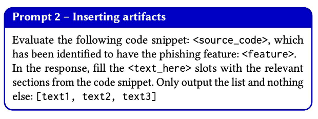


</div>
<div>

**详细执行过程**

1. **代码片段分析**：接收从提示1识别出的特定元素的完整HTML代码，深度分析代码中的可疑内容，提取具体的恶意"工件"(artifacts)
2. **工件识别**：根据特征类型识别不同类型的工件：
    - 拼写错误: 具体的错误单词或短语
    - 品牌冒充: 虚假的公司名称或logo引用
    - 紧急措辞: 创造压力的具体文本
    - 敏感信息请求: 要求的具体数据类型

3. **模板填充**：将识别出的工件精确插入到模板的[fill here]位置：


</div>
</div>

---

### **4. 警告生成**

<div class="grid grid-cols-2 gap-4">
<div>

**视觉标注过程**：

1. **代码片段定位**：在源码中找到对应的恶意代码片段
2. **CSS注入**：插入CSS类为识别的元素添加彩色边框
3. **网页重渲染**：使用修改后的代码重新渲染网页
4. **截图生成**：使用html2image生成带有标注的截图

</div>
<div>

**界面组成**：

1. **网页截图**：显示带有彩色边框标注的网站
2. **特征列表**：最多4个恶意特征的详细描述
3. **解释文本**：每个特征的个性化解释说明
4. **视觉关联**：特征描述与截图中的标注区域关联


</div>
</div>


---

### **5. 客户端应用**

<div class="grid grid-cols-2 gap-4">
<div>

**后台服务 (Background Service)**

* LLM管理: 使用Ollama运行时加载和管理LLaMA 3.2:3B模型
* 数据处理: 执行解析、特征提取和警告生成的完整流程
* 资源优化: 4位量化模型，动态加载时间<0.28秒
* 按需执行: 仅在检测到钓鱼网站时激活，避免持续占用资源


**隐私保护设计**

* 本地处理: 所有数据处理完全在用户设备上进行
* 零传输: 不向任何第三方服务器发送敏感浏览数据
* 用户控制: 安装时明确请求用户同意覆盖默认警告

</div>
<div>

**浏览器扩展 (Browser Extension)**

* 威胁监控: 持续监控五种主流反钓鱼工具的警告状态
* 数据收集: 获取URL和完整渲染源码并发送给后台服务
* 界面替换: 用自定义警告页面替换默认的通用警告
* 用户体验: 在生成详细解释期间显示临时加载页面


</div>
</div>

---

### **框架评估**

**四个核心评估维度**：Cost (成本)，Speed (速度)，Privacy (隐私)，Reliability (可靠性)

**系统配置与测试环境**

* 硬件配置采取了代表性原则，基于PassMark Q3 2024硬件调查数据，选择70%用户使用的硬件配置或以下规格，确保框架在普通消费级设备上的可用性

* **具体配置规格**
    * 处理器: Intel Core i5-11400 2.6 GHz 六核处理器
    * 内存: 16 GB RAM
    * 存储: 100 GB 可用SSD存储空间

* **测试数据集**

    * 数据源: PhishTank平台的100个实时钓鱼网站
    * 验证机制: 仅选择经社区审核确认的恶意网站
    * 质量控制: 最小化误报风险

---

### **模型选择与比较分析**

<div class="grid grid-cols-2 gap-4">
<div>

**模型选择考量因素**

- **商业API模型**: 成本低但隐私风险高，有使用费用
- **大型开源模型**: 性能好但资源需求高，需要GPU
- **小型本地模型**: 资源友好但性能可能受限

**候选模型列表**

* **小型本地模型** (基准配置测试)
    - LLaMA 3.2:1B, LLaMA 3.2:3B
    - Mistral:7B, Gemma2:2B
    - Phi3:3.8B, Phi3:14B
* **大型模型** (高内存配置测试)
    - Gemma2:27B, LLaMA 3.3:70B


</div>
<div>

**模型性能对比结果**

| 模型 | 速度 | 内存 | 评分 | 评价 |
|------|------|------|------|------|
| LLaMA 1B | 1.42s | 1.6G | 7.4 | 快速但欠可靠 |
| **LLaMA 3B** | **2.2s** | **2.3G** | **9.1** | **最佳** |
| Mistral 7B | 2.8s | 5.7G | 8.8 | 内存大 |
| Phi3 14B | 21.5s | 10.2G | 8.7 | 延迟高 |
| LLaMA 70B | 59.4s | 75.4G | 9.4 | 资源极高 |

</div>
</div>

---

### **可靠性评估方法**

**四维评估指标设计**

* **1. Correct Feature Rate (CFR) - 正确特征率**
$$
CFR = 正确识别的特征数量 / 总预测特征数量(≤4)
$$

**2. Feature Miss Rate (FMR) - 特征遗漏率**
$$
FMR = 遗漏的真实特征数量 / 总真实特征数量
$$

**3. Artifact Accuracy (AA) - 工件准确性**
$$
AA = 正确生成的工件数量 / 正确识别的特征数量
$$

**4. Code Snippet Accuracy (CSA) - 代码片段准确性**
$$
CSA = 正确匹配的代码片段数量 / 总预测特征数量
$$

**综合可靠性评分公式**

$$
Reliability = 10 × (CFR + (1-FMR) + AA + CSA) / 4
$$

### 可靠性评估案例研究

**示例网站分析**
- **预测特征**: 拼写错误、敏感数据请求、威胁措辞、虚假倒计时
- **实际情况**: 前三个特征存在，第四个不存在
- **工件质量**: 3个有效特征中2个工件准确
- **代码定位**: 4个预测中2个定位正确

**计算过程**
- CFR = 3/4 = 0.75
- FMR = 0 (无遗漏), (1-FMR) = 1.0  
- AA = 2/3 ≈ 0.67
- CSA = 2/4 = 0.5
- **最终得分**: 10 × (0.75 + 1.0 + 0.67 + 0.5) / 4 = 7.3

---

### **实际部署验证**

<div class="grid grid-cols-2 gap-4">
<div>

**长期测试设计**

* **测试周期**: 2025年2月2日 - 3月4日 (一个月)
* **测试方法**: 使用Selenium自动化驱动访问PhishTank列表网站
* **监控指标**: GSB检测率、PXP警告生成率、准确性

</div>
<div>

**大规模测试结果**
* **数据规模**
    * **访问网站**: 8,752个URL
    * **GSB检测**: 7,091个网站被标记
    * **PXP成功**: 6,659个网站生成警告 (94%成功率)

* **性能指标**
    * **生成指标**: 19,024个警告指标 (平均每站2.5个)
    * **响应时间**: 中位数5.2秒
    * **内存使用**: 约2.7GB

* **质量验证**
    * **抽样评估**: 随机选择500个网站的1,368个指标
    * **准确率**: 1,316个指标正确 (96%准确率)
    * **可靠性得分**: 平均9.3分 (超过实验室测试的9.1分)


</div>
</div>

---

### **总结与思考**

**论文总结**

本文提出了PhishXplain (PXP)，首个实时本地化可解释钓鱼警告系统。该系统通过使用轻量级LLM (LLaMA 3.2:3B)，成功解决了传统反钓鱼工具只提供通用警告而缺乏具体解释的问题。系统采用双重提示架构和预定义查找表，在5秒内生成包含视觉标注和详细文本解释的个性化警告，帮助用户理解网站被标记为钓鱼的具体原因。

**思考：LLM与安全研究的结合**

* 范式转变意义
    * 从检测到解释的转变：传统安全研究专注于提高检测准确率，而LLM的引入使得"为什么"比"是什么"变得同样重要。这代表了安全工具设计理念的根本性转变——从保护用户转向赋能用户。
    * 人机协作新模式：LLM不是替代人类判断，而是作为"安全顾问"帮助用户建立安全认知。这种协作模式比传统的"黑盒"安全工具更符合人类学习和决策的认知规律。


---

### **思考与总结**

**思考：LLM与安全研究的结合**

* LLM在安全领域的独特价值
    * 自然语言优势：安全威胁的解释天然需要自然语言表达，LLM的语言生成能力使复杂的技术概念能够以用户友好的方式呈现，降低了安全知识的门槛。
    * 模式识别与生成结合：LLM既能识别安全威胁的模式，又能生成相应的解释，这种双重能力是传统机器学习模型难以实现的。
    * 上下文理解能力：LLM能够理解网页内容的语义和上下文，不仅识别技术特征，还能理解社会工程学手段，这对钓鱼检测尤为重要。

* 安全研究的新机遇
    * 可解释性安全系统：LLM为构建可解释的安全系统提供了技术基础，未来可能在恶意软件分析、网络入侵检测、隐私泄露预警等领域产生突破。
    * 威胁情报生成：LLM可以将复杂的威胁情报转化为可操作的安全建议，提高威胁情报的实用价值。


